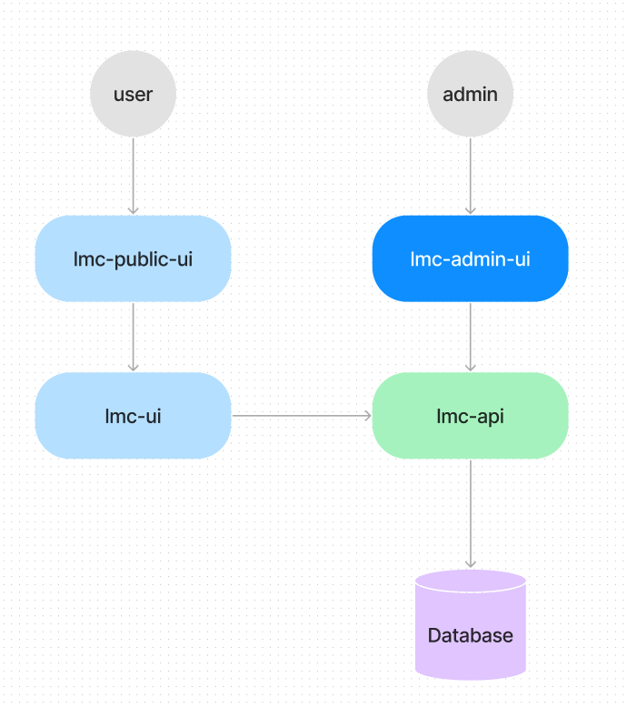
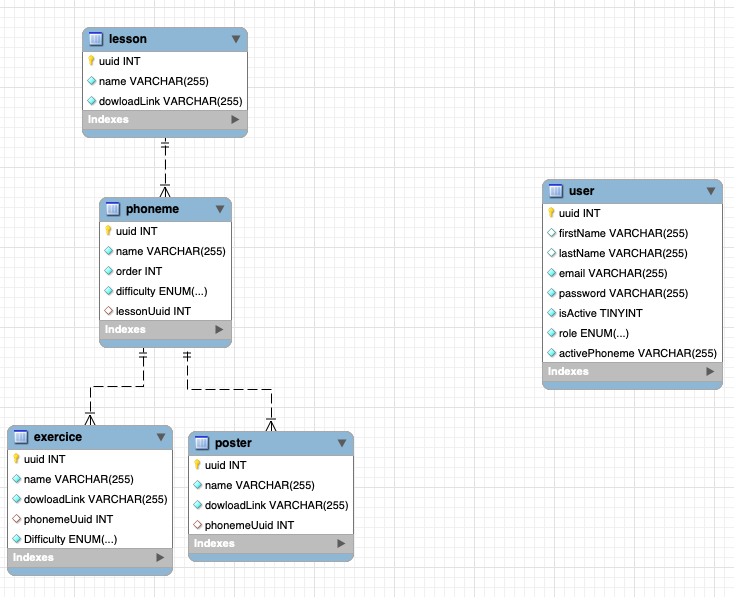

# La Méthode Claire - Wiki 📝

> Welcome to this wiki ! This documentation will explain all technical aspects of this Projects from a functional perspectives.

## Architecure 🏗️

### Applications' architecture 🔗

> The document below represent the workflow and connections for every needs of the app.

### Database model 💾

> To represent the business logic of the application, some entity must be stored in database. This document helps understand how every entities are related
> and so, understand their benefits and limitations.

